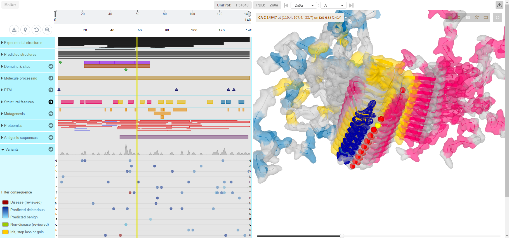

# PROTESTANT (PROTEin STructure ANnoTator)

PROTESTANT is a responsive, easy-to-use JavaScript plugin coupling protein sequence annotation capabilities provided by [ProtVista](https://github.com/ebi-uniprot/ProtVista) with structure visualization capabilities provided by [LiteMol](https://github.com/dsehnal/LiteMol). Since it does not have any software dependencies and all the data are obtained on the fly, it is easy to integrate it to any web page.

    

## Features overview

- Visualization of protein structure as provided by LiteMol
- Annotation of protein sequence as provided by ProtVista
- Automatic retrieval of sequence data based on UniProt ID and corresponding experimental structures from PDB
- Mapping of structure on corresponding substring in the sequence
- Retrieval of predicted models from [SWISS-MODEL Repository](https://swissmodel.expasy.org/repository) (SMR) if no PDB structure is available
- Controlling transparency of the structure to see both cartoon and surface view of the structure
- Hovering over position in sequence to highligt it in structure and vice versa
- Color overlay any sequence feature over the structure
- Color overlay all sequence features of given type over the structure
- Color overlay individual variation over the structure
- Color overlay all mutations to given amino acid over the structure
- Color overlay mutation frequency of residues over the structure
- Exports of the structure and annotations to [PyMol](https://pymol.org/2/) for advanced inspection

## Data sources

- Sequence and annotation data
  - Sequence information comes from [UniProt website REST API](https://www.uniprot.org/help/api)
  - Sequence annotations are provided by the ProtVista plugin which utilizes the EBI's [Proteins REST API](https://www.ebi.ac.uk/proteins/api/doc/). Proteins API includes access to variation, proteomics and antigen services containing "annotations imported and mapped from large scale data sources, such as 1000 Genomes, ExAC (Exome Aggregation Consortium), COSMIC (Catalogue Of Somatic Mutations In Cancer), PeptideAtlas, MaxQB (MaxQuant DataBase), EPD (Encyclopedia of Proteome Dynamics) and HPA, along with UniProtKB annotations for these feature types".
- Structure mapping
    - To obtain the mapping between UniProt and PDB, PROTESTANT is using the [SIFTS API](https://www.ebi.ac.uk/pdbe/api/doc/sifts.html), part of the [PDBe REST API](http://www.ebi.ac.uk/pdbe/pdbe-rest-api).
    - In case the SIFTS mapping yields no PDB structures, SMR is queried using its [API](https://swissmodel.expasy.org/docs/repository_help#smr_api) for available models.
- Structure data
  - In case an experimental structure is available in PDB for given UniProt ID, this structure is downloaded by LiteMol. In this case, PROTESTANT instructs LiteMol to use the mmCIF format.
  - In case there is no experimental structure in PDB, but a model exists in SMR, PROTESTANT instructs LiteMol to use the PDB-format structure data from SMR.

## How to use PROTESTANT

The detail description of how to incorporate PROTESTANT into your project can be found in the [developer documentation](tree/master/documentation).

The general process consists of the following steps

- Obtain the JavaScript file with PROTESTANT and link it from your web page
- Create a container DIV (or SPAN) element which will hold the viewer
- Create a JavaScript object and pass it reference to the DIV

### Examples of use
The ``examples`` folder holds examples of how to use PROTESTANT.
- See the ``plugin-page.html`` file for aa example of how to integrate a single instance of the plugin in your web page.
- For an advanced example, see the ``web`` directory. It contains a simple web application which enables querying Uniprot (only top 10 matches are retrieved) and for every found record one can click the UniProt ID which creates a new tab with new instance of PROTESTANT for that UniProt ID. Running instance of this web server can be found [here](https://minerva-dev.lcsb.uni.lu/protestant/).

## Contributing

We would be happy to hear about your use cases, experiences and ideas/feature requests. Either raise an issue [here](https://github.com/davidhoksza/PROTESTANT/issues) or get in touch by mail.

## Support

Please submit your issues through the PROTESTANT's repository issue tracker available [here](https://github.com/davidhoksza/PROTESTANT/issues).

## License

This project is licensed under the Apache 2.0 license, quoted below.

Copyright (c) 2018 David Hoksza

Licensed under the Apache License, Version 2.0 (the "License"); you may not use this file except in compliance with the License.
You may obtain a copy of the License at

    http://www.apache.org/licenses/LICENSE-2.0

Unless required by applicable law or agreed to in writing, software distributed under the License is distributed on an "AS IS" BASIS,
WITHOUT WARRANTIES OR CONDITIONS OF ANY KIND, either express or implied. See the License for the specific language governing permissions and limitations under the License.

